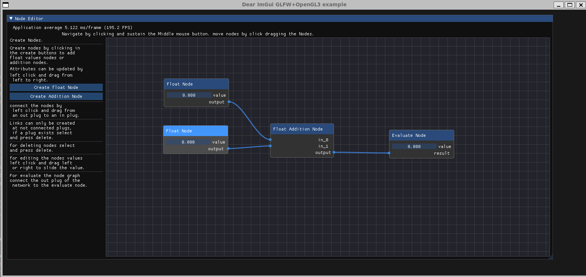

# CPPND: Capstone Node Editor

This is the repo for the my Capstone project in the [Udacity C++ Nanodegree Program](https://www.udacity.com/course/c-plus-plus-nanodegree--nd213).

The Capstone Project gives you a chance to integrate what you've learned throughout this program. This project will become an important part of your portfolio to share with current and future colleagues and employers.

In this project, you can build your own C++ application starting with this repo, following the principles you have learned throughout this Nanodegree Program. This project will demonstrate that you can independently create applications using a wide range of C++ features.

# Goal
* Create a prototype of a node base application.
* Resolve the logic associated of traversing the node graph and computing the result.
* Resolve the Propagation of changes (dirty propagation) in the node graph.
* Managing nodes creation, deletion and edition.
* Managing link creation and deletion.

## Capstone Node Editor:

The Node editor is using ImGui along with ImNodes for displaying the nodes in the viewport.
the main interface is divided in two parts:
# the creator panel (also the instructions for use.)
  * this interface has to buttons:
    * Create float Node. this button creates an instance of a FloatNodeContainer.
      this node acts like a variable it holds the value of a float and can be modified by dragging the mouse over (left click).
    * Created Addition Node. this button creates an instance of FloatAdditionNode that has the ability of adding the input connections.
      but it can be used alone, it contains 2 float values that can be dragged. if a connection is made the default values will be hidden
      so it is clear that is only computing the input connections.

* the Canvas viewport.
This canvas can be navigated using the middle mouse button, It has by default an instance of EvaluationNodeContainer, this evaluation node
performs the evaluation of the graph connected to it. for now it can only be one Evaluation node.

## Project structure:
The project is contained in the src folder.
* Capston_Node_Editor->
  * cmake
  * images
  * src
    * external
    * test   

the external libraries are stored under the "external" folder (ImGui, ImNodes).
no editions has been done to this libraries.

Some Basic test Functions are inside the "test" folder, this functions were used during development to test the logic in the nodes.
the "src" folder contains all the work done during the development.

## App class.
the basic functionality for creating the app window is inside the App class witch inherits from GLFWAppBase, this class
contains the basic call for the ImGui to call the back end of GLFW. 
| [GLFWappBase] (https://github.com/vfxsnake/Capston_Node_Editor/blob/main/src/glfw_app_base.hpp)

## nodes.h and nodes.cpp
Hire is defined all the logic for the nodes. the Nodes are inherited from the Class AbstractNode that has the basic functionality.
That will help later on in traversing the node graph so it can be computed.
The nodes are made of the composition of Plugs (plugs_ins and Plugs_outs).
* Each node must deal with the allocation of resources. As each node is unique, unique pointers so no data will be copied out of the node
* the mechanism of communication is through reference.
* Each Node has a compute method that executes the logic.
| [Nodes] (https://github.com/vfxsnake/Capston_Node_Editor/blob/main/src/node_editor.h)

For now is only supporting addition and subtraction for float values, but it can be extended to any type of value.

The evaluation process is done by the EvaluateNode, it uses a recursive function to traverse from connection to connection. until there's no
other node to iterate, then it looks for changes in the nodes (dirty propagation) to see if it needs to recompute the graph.
[Iterate Graph] (https://github.com/vfxsnake/Capston_Node_Editor/blob/main/src/nodes.cpp#:~:text=%7D-,bool%20EvaluationNode%3A%3AIterateGraph(AbstractNode*%20node),%7D,-bool%20EvaluationNode%3A%3ACompute)

## plugs.hpp

## Dependencies for Running Locally
* cmake >= 3.7
  * All OSes: [click here for installation instructions](https://cmake.org/install/)
* make >= 4.1 (Linux, Mac), 3.81 (Windows)
  * Linux: make is installed by default on most Linux distros
  * Mac: [install Xcode command line tools to get make](https://developer.apple.com/xcode/features/)
  * Windows: [Click here for installation instructions](http://gnuwin32.sourceforge.net/packages/make.htm)
* gcc/g++ >= 5.4
  * Linux: gcc / g++ is installed by default on most Linux distros
  * Mac: same deal as make - [install Xcode command line tools](https://developer.apple.com/xcode/features/)
  * Windows: recommend using [MinGW](http://www.mingw.org/)
* GLFW:
  * linux: sudo apt-get install libglfw3-dev
  * Mac and windows you can see the instructions hire: [GLFW](https://www.glfw.org/)
## Basic Build Instructions

1. Clone this repo:
  * git clone --recursive https://github.com/vfxsnake/Capston_Node_Editor.git
2. Make a build directory in the top level directory: `mkdir build && cd build`
3. Compile: `cmake .. && make`
4. Run it: `./capstone_node_editor`.